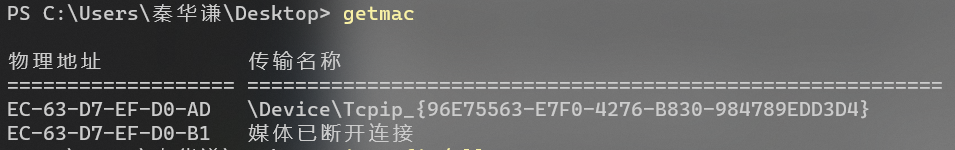
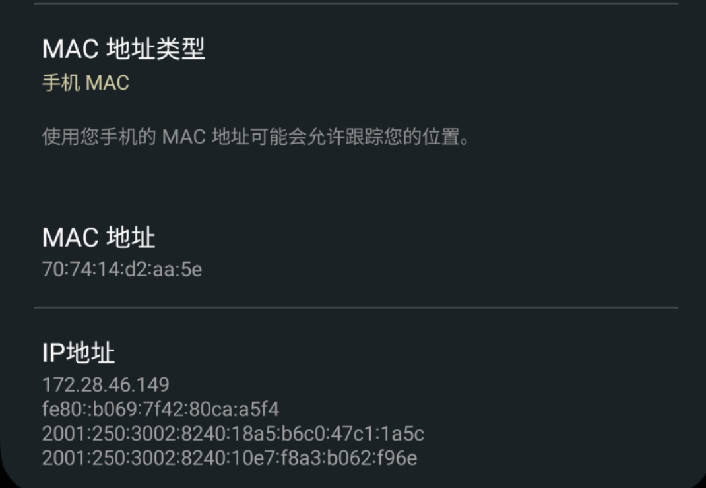
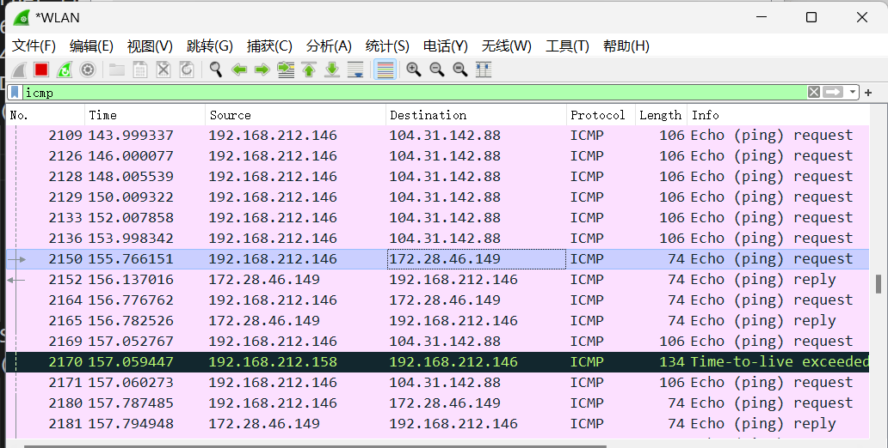
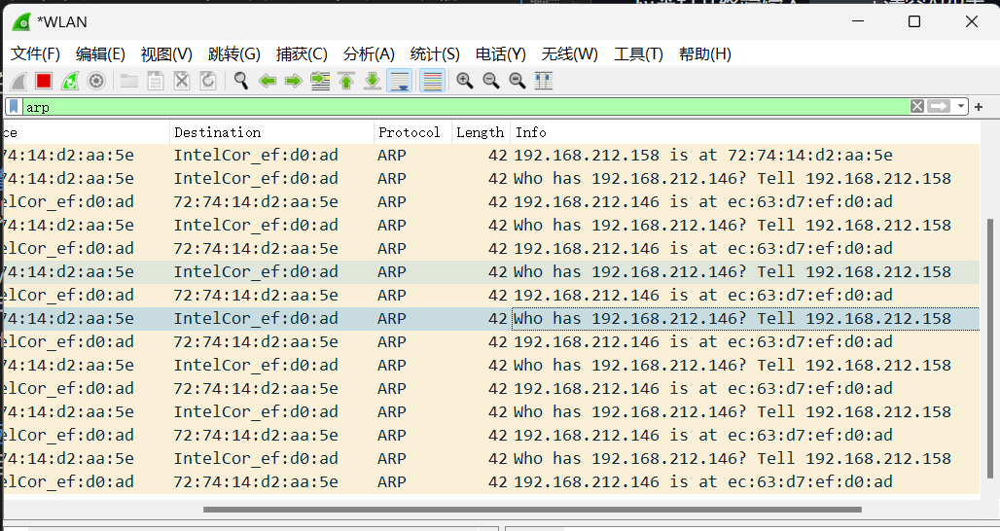
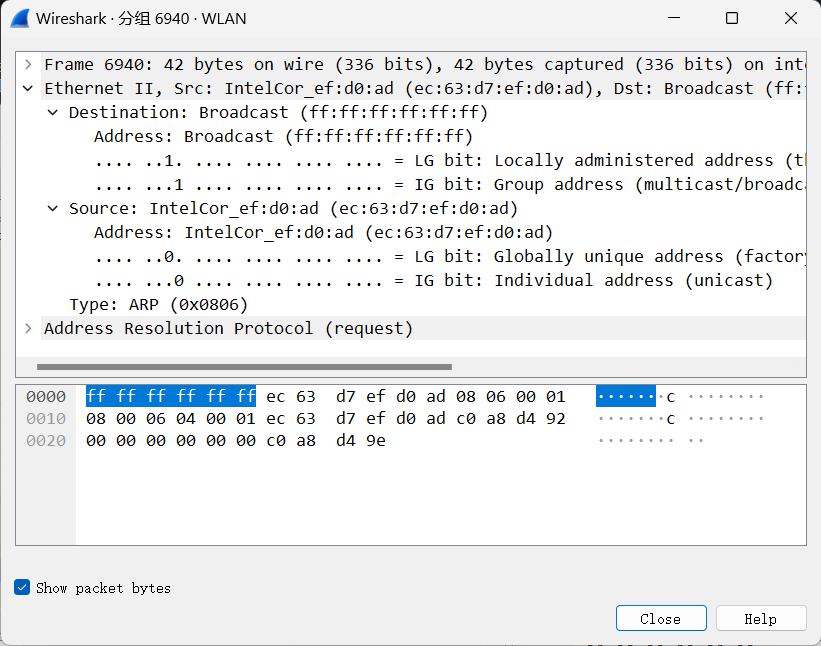
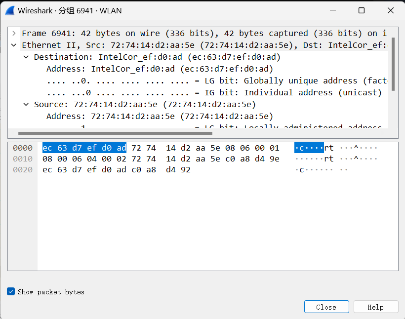

# 网络抓包与协议分析

***

## **Commend**:

### 显示过滤器指令

显示arp协议报文（TCP/UDP/ICMP 同理）
```
arp    
```
显示源地址为a.b.c.d的icmp报文（ping的时候用的就是icmp报文）
```
ip.src == a.b.c.d && icmp
```

### 终端指令
```
arp -d  删除所有的ip地址项
    -s InetAddr EtherADDR [IfaceAddr]
    在ARP缓存中添加对应InetAddr地址的EtherAddr地址静态项
```

***

<br>

## 实验1.1 Wireshark软件使用与ARP协议分析

**监测端口：**
由于本人在用自己的终端同时作为发送端，手机的安卓终端作为接收端，利用移动热点搭建局域网，所以监测端口`WLAN`

### 实验1.1.1 观察MAC地址
***step1:*** 
终端中输入`ipconfig`得发送端ip地址如下

.png "Magic Gardens")
检查发送端的mac地址如下

在安卓终端中检查IP地址与MAC地址如下：
***要注意关闭随机MAC功能***


以发送端主机MAC地址`ec:63:d7:ef:d0:ad`为例
```
这个 MAC 地址的 OUI 是 "EC:63:D7"，这个 OUI 代表的是 "Fiberhome Telecommunication Technologies Co., Ltd." 这个公司。

MAC 地址中的 I/G 位（第七位）指示了地址的类型。如果这个位被设置为0，那么这个地址是一个单播地址（unicast），它只会被发送到一个特定的接口。如果这个位被设置为1，那么这个地址是一个组播地址（multicast），它可以被发送到多个接口。

MAC 地址中的 G/L 位（第八位）指示了地址的全局/本地性。如果这个位被设置为0，那么这个地址是一个全局地址，可以跨越不同的子网。如果这个位被设置为1，那么这个地址是一个本地地址，只能在同一个子网内使用。

在这个 MAC 地址中，I/G 位是0，表示这是一个单播地址，而 G/L 位是0，表示这是一个全局地址。
```

<br>

***step2:*** 
在 Wireshark 显示捕捉器中中输入`icmp`，捕捉往返于目标服务器的ping数据包



***step3:*** 
启动终端，输入`ping 172.28.41.25`即可在Wireshark界面中看到icmp报文，双击打开，展开以太网Ⅱ

```
Ethernet II, Src: IntelCor_ef:d0:ad (ec:63:d7:ef:d0:ad), Dst: 70:74:14:d2:aa:5e (70:74:14:d2:aa:5e)
    Destination: 70:74:14:d2:aa:5e (70:74:14:d2:aa:5e)
        Address: 70:74:14:d2:aa:5e (70:74:14:d2:aa:5e)
        .... ..1. .... .... .... .... = LG bit: Locally administered address (this is NOT the factory default)
        .... ...0 .... .... .... .... = IG bit: Individual address (unicast)
    Source: IntelCor_ef:d0:ad (ec:63:d7:ef:d0:ad)
        Address: IntelCor_ef:d0:ad (ec:63:d7:ef:d0:ad)
        .... ..0. .... .... .... .... = LG bit: Globally unique address (factory default)
        .... ...0 .... .... .... .... = IG bit: Individual address (unicast)
    Type: IPv4 (0x0800)

```

观察报文的distnation：`70:74:14:d2:aa:5e == 70:74:14:d2:aa:5e`

观察source：`ec:63:d7:ef:d0:ad == ec:63:d7:ef:d0:ad`

### 实验1.1.2 ARP协议分析
&emsp;&emsp;ARP是地址解析协议，主要作用是 **将IP地址解析成MAC地址** ，因为在数据链路层封装的时候必须有 IP地址和目标主机或下一跳服务器的MAC地址。  

本次使用的安卓终端的局域网ip地址为`192.168.212.146`

&emsp;&emsp;发送端主机自己会维护一个ARP表，会首先查看自己的ARP表，如果表中有IP-MAC对，则不会发送ARP报文。因此，要观察到ARP报文首先应当打开终端清空ARP表，然后ping。    
```
arp -d
ping 192.168.212.146
```

然后在显示过滤器中输入`arp`捕捉ARP报文


<font color=yellow>***请求报文***<br></font>

可以观察到一个Broadcast类型报文 INFO栏内容为 
```
    Who has a.b.c.d? Tell a'.b'.c'.d'
```
&emsp;&emsp;展开可以看到以太网Ⅱ端口的MAC地址栏为`ff:ff:ff:ff:ff:ff`表示不清楚目的端口，询问

<br>

<font color=yellow>***回传报文***</font><br>

随后目标主机收到了广播，自己发送回传报文，Info为
``` 
a.b.c.d is at xxx:xxx(MAC)
```
展开以太网Ⅱ发现MAC位置已经用MAC地址替代了fff


### <font color=red>Bug Analysis：</font>
#### 1. 获取目标MAC地址出错
最开始的时候在捕获的报文中总是无法将接收端的实际MAC地址和捕获的报文中的MAC地址进行对应，
效果如下

    Destination: a2:9a:82:2c:95:29
后来发现原因是安卓端自动开启了随机MAC地址导致的，修改设置后成功

#### 2. 无法在终端中执行`arp -d`命令
```
PS C:\Users\秦华谦> arp -d
ARP 项删除失败: 请求的操作需要提升。
```
研究发现是当前终端的权限不够，以管理员身份重启终端以后就正常了
<br>

### <font color=skyblue> **思考题：** </font>
#### 1. 使用了显示过滤器后， Wireshark 的抓包工作量会减少吗？
&emsp;&emsp;过滤器只是用于显示的目的，而不是真正的抓包过滤器。即使设置了过滤器，Wireshark 仍会抓取整个网络接口上的所有数据包，然后使用过滤器来决定哪些数据包应该被显示出来。因此，如果网络非常繁忙，过滤器不会减少抓包的工作量，但可以减少分析数据包的时间和精力

#### 2. MAC 帧的长度和 IP 数据报的长度有怎样的关系？

#### 3. 假设本机 IP 地址是 192.168.0.38，在本机上运行 Wireshark 捕获报文，使用`ip.addr == 192.168.0.38`作为过滤条件，能否过滤出本机发出/收到的ARP报文？为什么？
&emsp;&emsp;使用过滤条件 ip.addr == 192.168.0.38 无法过滤出本机发出/收到的 ARP 报文，因为 ARP 协议不使用 IP 地址进行传输，而是使用数据链路层的 MAC 地址。
当主机需要了解某个 IP 地址对应的 MAC 地址时，它会发送一个 ARP 请求，请求对应 IP 地址的主机回复它的 MAC 地址。ARP 请求和回复报文是在数据链路层中直接发送和接收的，并不需要 IP 地址的参与。

&emsp;&emsp;因此，如果想要过滤出本机发出/收到的 ARP 报文，应该使用以下过滤条件之一：
```
arp
    这将过滤所有 ARP 报文，包括本机发出/收到的。
arp and ether src host <本机MAC地址> 
    这将过滤本机发送或接收的 ARP 报文，其中 <本机MAC地址> 是你的本机 MAC 地址，可以在 Wireshark 中找到。
```
#### 4. ping 同一局域网内的主机和局域网外的主机，都会产生 ARP 报文么？所产生的 ARP 报文有何不同，为什么？

&emsp;&emsp;在 ping 同一局域网内的主机时，会产生 ARP 报文。因为在同一局域网中，主机之间的通信是通过数据链路层的 MAC 地址实现的，而 ARP 协议用于将 IP 地址转换为 MAC 地址。因此，当一个主机向另一个主机发送 ICMP 请求（ping）时，它需要先通过 ARP 协议查询目标主机的 MAC 地址，才能向目标主机发送数据包。

&emsp;&emsp;当 ping 局域网外的主机时，会产生不同的 ARP 报文。这是因为在跨越不同网络的情况下，通信需要经过路由器进行转发，而路由器连接了不同的网络，需要知道目标主机的 MAC 地址才能将数据包正确地发送到目标主机。因此，当一个主机向另一个网络中的主机发送 ICMP 请求时，它需要通过 ARP 协议查询路由器的 MAC 地址，并将数据包发送到路由器，由路由器转发到目标主机。

&emsp;&emsp;因此，ping 同一局域网内的主机和局域网外的主机都会产生 ARP 报文，但产生的 ARP 报文不同。<font color=yellow>在同一局域网中，ARP 报文用于查询目标主机的 MAC 地址；而在跨越不同网络时，ARP 报文用于查询路由器的 MAC 地址。</font>

#### 5. ARP 请求数据包是支撑 TCP/IP 协议正常运作的广播包。如果滥发或错发 ARP 广播包会产生那些不良影响？如何发现和应对？

滥发或错发 ARP 广播包可能会对网络造成以下不良影响：

- 消耗网络带宽：ARP 广播包是广播发送的，这意味着它会被发送到同一网络中的所有主机。如果 ARP 广播包的数量太多，将会占用网络带宽，影响网络性能。
- 节点资源浪费：当节点收到一个错误的 ARP 广播包时，它将尝试响应该请求并更新自己的 ARP 缓存，这可能导致节点浪费资源来处理无效的请求。
- 安全威胁：ARP 广播包可以被用来欺骗网络中的主机，从而进行 ARP 欺骗攻击和中间人攻击。

为了发现和应对滥发或错发 ARP 广播包，可以使用以下方法：

- 使用网络分析工具，如 Wireshark，来监视网络流量并分析 ARP 广播包的数量和来源。
- 使用入侵检测系统（IDS）来检测 ARP 欺骗攻击和中间人攻击。
- 通过限制网络上允许使用 ARP 广播包的设备数量或使用 ARP 防火墙等安全措施来限制 ARP 广播包的数量。
- 对于错误的 ARP 广播包，可以使用网络管理工具或安全软件来自动封锁源主机或对其进行隔离，以避免它们对网络造成威胁。

#### 6. 什么是免费 ARP（ Gratuitous ARP）？它的作用是什么？请使用 Wireshark 进行捕捉和分析。

&emsp;&emsp;免费 ARP（Gratuitous ARP）是一种特殊类型的 ARP 报文，用于主机主动通知本网络上的其他主机，它的 IP 地址与 MAC 地址的映射关系已经发生了变化。

免费 ARP 的作用有多种：

- 更新 ARP 缓存：当主机的 MAC 地址发生变化时，它可以使用免费 ARP 报文来通知其他主机更新它们的 ARP 缓存。这可以防止其他主机使用过期的 ARP 缓存条目，导致通信失败或安全问题。

- 解决 IP 地址冲突：当两个主机在同一网络上使用了相同的 IP 地址时，它们可能会发送 ARP 请求，查询相同 IP 地址的 MAC 地址，这可能导致通信故障。在这种情况下，一个主机可以使用免费 ARP 报文，告知网络上的其他主机，它将会使用该 IP 地址，并通知其他主机停止使用该 IP 地址。

## 实验1.2 IP与ICMP分析
